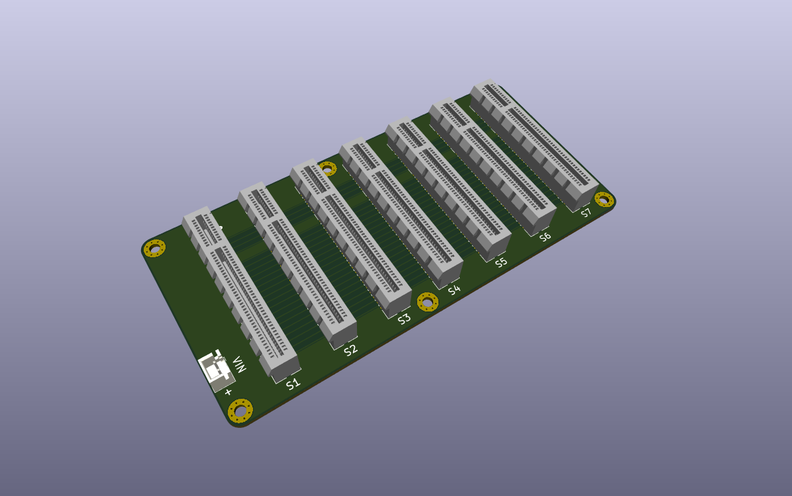

# Data Acquisition - Backplane

| :warning: WARNING                                               |
| :-------------------------------------------------------------- |
| This design is an unverified work in progress (as of May 2023). |

## Overview

The backplane is is a passive motherboard that accepts plugin boards with the functionality of the DAQ system.

## Design decisions

* Passive design, all active components are on plugin boards.
* Using common and inexpensive PCIE X8 connectors (98 pins). However, the power and signals are not compatible with PCIE.
* Symmetric slots. Slots are interchangeable and boards can be plugged in any slot. When applicable, conflict resolution is delegated to the plugin boards, e.g. using configuration jumpers.
* Scalable. Versions with higher/lower number of slots can be easily derived.
* 12-24VDC Power is provided via an on board connector and is routed to all slots. Plugin boards should use **insulated** DC/DC converters to generate supply rail voltages.
* Assigned pins for 5V supply, which is provided by an insulated power supply plugin board.
* Using through hole connectors for mechanical rigidity. An SMD version can be derived if so desired.
* 'Sufficient' signal integrity and bandwidth. The backplane is intended for relatively slow signals at the order of 1Mhz, that are driven directly by an MCU and peripherals, and thus, the backplane uses an inexpensive 4 layers PCB and minimal number of GND pins.

## Mechanical Dimensions

140mm X 67mm, 4 layers.

## Signals Assignment

As of May 2023, these are the assigned bus pins. All are reserved.

> **_TODO:_** Add the rest of the signals.

| Pin | Signal | Notes                            | Pin | Signal | Notes               |
| --- | ------ | -------------------------------- | --- | ------ | ------------------- |
| B1  | +5V    | Generated by Power Supply board. | A1  | GND    |                     |
| B2  | +5V    | Generated by Power Supply board. | A2  | GND    |                     |
| B3  | +5V    | Generated by Power Supply board. | A3  | GND    |                     |
| B4  | +5V    | Generated by Power Supply board. | A4  | GND    |                     |
| ... |        |                                  |     |        |                     |
| B48 | VIN+   | Insulated from GND. 12-24VDC     | A48 | VIN-   | Insulated from GND. |
| B49 | VIN+   | Insulated from GND. 12-24VDC     | A49 | VIN-   | Insulated from GND. |

## BOM

The key components are:

* PCIE X8 (98 pins) through hole connected. Preferably non slotted.
* JST XH two pin connector, preferably with positioning pin.
