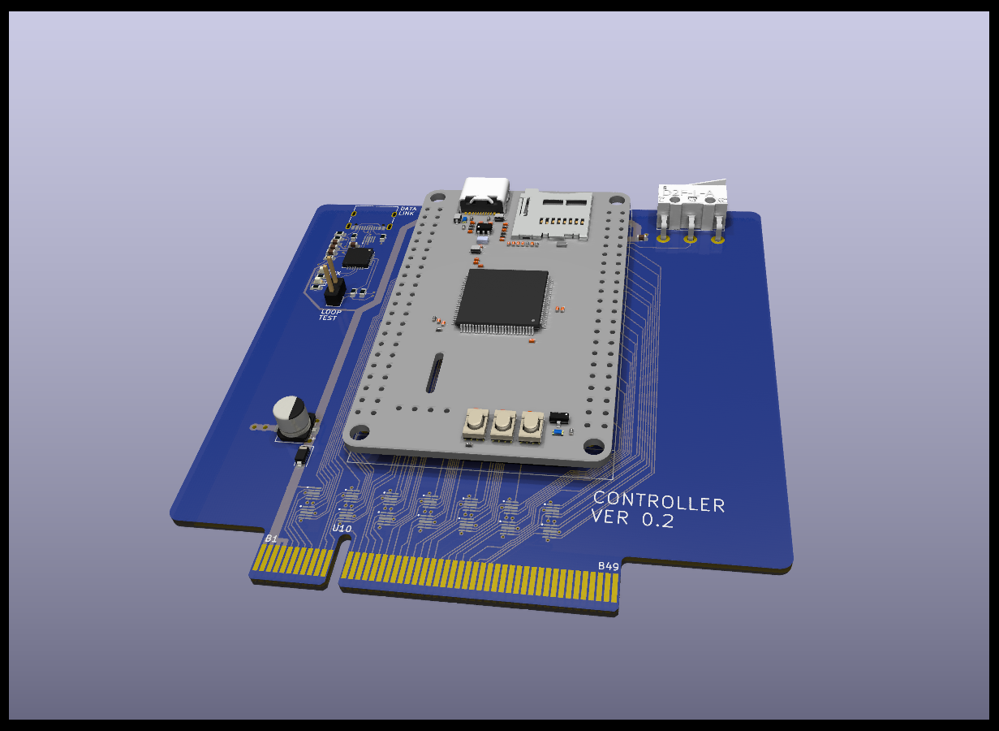

# Data Acquisition - Controller board.

| :warning: WARNING                                               |
| :-------------------------------------------------------------- |
| This design is an unverified work in progress (as of May 2023). |

## Overview

This plugin board contains the microcontroller that controls the system and communicates with the host PC. It is based on the WeAct Studio STM32H750 module, and future version may have the STM32H750 MCU directly on the board.

## Design decisions

* All the MCU signals are routed to the bus, to provide flexibility and future system expansion.
* All signals are protected against ESD using TVS diodes.
* Controller can be powered from the bus or from the USB port, with power arbitration using OR'ed diodes. The USB power does not power the bus to avoid overloading the host computer.
* The WeAct module can be soldered to the board using pin header or can be removable using a set of male/female headers.

## BOM

Key components:

* WeAct Studio [STM32H750 module](https://github.com/WeActStudio/MiniSTM32H7xx).
