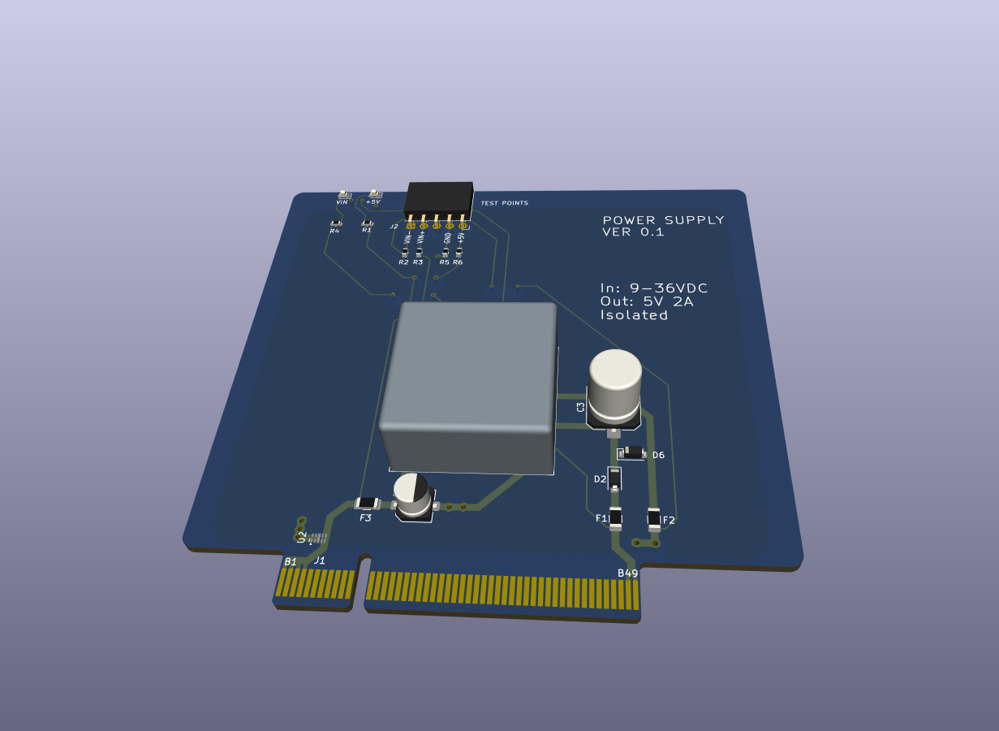

# Data Acquisition - Power Supply board.

| :warning: WARNING|
|:---|
| This design is an unverified work in progress (as of May 2023).|

## Overview

This plugin board contains an DC/DC module which generates the 5VCD feed of the bus from the 12-24V DC input.

## Design decisions

* The power supply is isolated such that VIN is not galvanically connected to the system.
* Can provide 5V @ 2A from 9-36VDC input.
* Contains fuses on input and output voltages and ESD protection on the 5V output voltage.
* Contains indication LEDs for input and output voltages.
* Contains test points for input and output voltages.
* Inexpensive 2 layers PCB design with one layer dedicated for ground plane.
* Not intended for hot swapping.

## BOM

* URB2405YMD-10WR3 DC/DC module. Available from several vendors, with  
Mornsun being the canonical one.

