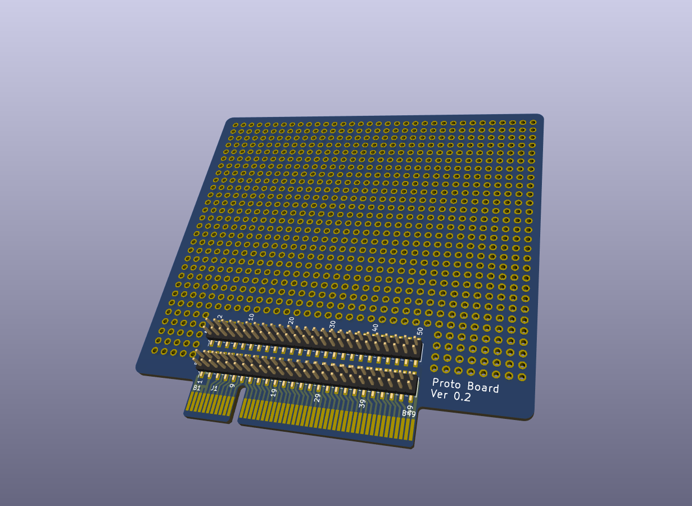

# Data Acquisition - Backplane

| :warning: WARNING|
|:---|
| This design is an unverified work in progress (as of May 2023).|

## Overview

A general purpose board for prototyping plugin boards.

## Design decisions

* Size is arbitrary, and independent of finalized form factor of the plugin boards.
* Provide access to all bus signals on both side of the board.
* Mounting holes for optional screw 'feet'.
* Low cost 100x91mm 2 layer PCB.
* No dedicated functionality such as 3.3V regulator, power/ground bus, etc.

## BOM

Key components:

* 2x25, SMD 2.00 pitch pin headers. Can be soldered on both side of the board. If can't find 2x25, get a larger one such as 2x40 and trim. Example https://www.aliexpress.us/item/2255801038200250.html
